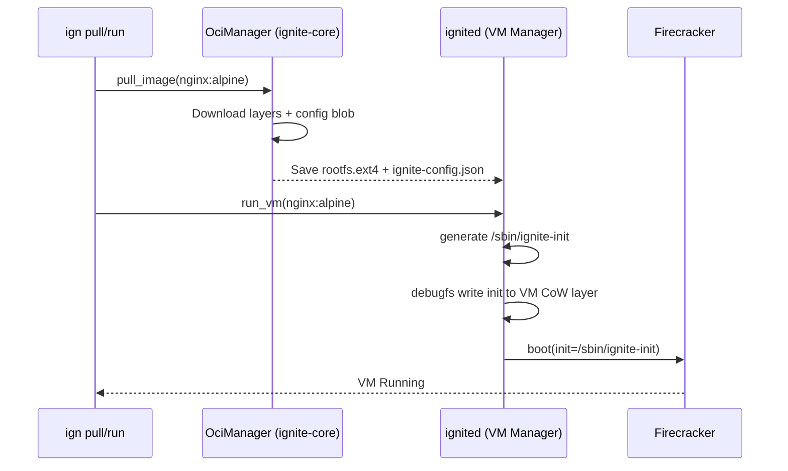

# ADR-020: OCI Image Configuration Injection (CMD/ENTRYPOINT/ENV)

## Status
Accepted | Phase 1 (v1.2)

## Context
Currently (v1.1), `ignite-core` pulls OCI layers and extracts the squashfs/ext4 rootfs correctly, but it entirely ignores the image's `config.json` blob which contains critical runtime metadata: `CMD`, `ENTRYPOINT`, `ENV`, and `WorkingDir`. Consequently, all VMs boot using `/bin/sh` as their PID 1 fallback. This prevents ~95% of unmodified Docker Hub images (e.g., `nginx`, `postgres`, `redis`) from functioning correctly out-of-the-box.

## Decision
We will inject OCI execution configurations directly into the VM boot process without modifying the read-only rootfs of the pulled image. 

1. **Extraction**: During `ign pull` and `ign build`, the `OciManager` will parse the layer metadata and emit an `ignite-config.json` file inside the `.ignite/images/<hash>/` directory alongside the `rootfs.ext4`.
2. **Boot Injection**: When `ign run` is invoked, `ignited` (the daemon) will dynamically generate a shell script (`/sbin/ignite-init`).
3. **Execution**: This script will be written directly into the VM's specific Copy-on-Write (CoW) delta layer using `debugfs` before the VM boots. 
4. **Kernel Cmdline**: Firecracker will be booted with `init=/sbin/ignite-init`. The script will export the environment variables, `cd` into the predefined WorkingDir, and `exec` the combined ENTRYPOINT + CMD array.

## Consequences
**Positive:**
- 100% compatibility with standard Docker Hub images that rely on `ENTRYPOINT` logic.
- Maintains the immutability of the base `rootfs.ext4` layer.
- No bulky agent needs to be bundled inside the VM yet (until Phase 4). 

**Negative:**
- Requires writing to the ext4 filesystem via `debugfs` before boot, slightly increasing the cold-boot latency (estimated +10-15ms overhead).
- Handling shell escaping for complex CMD arrays inside the `/sbin/ignite-init` script must be extremely robust to avoid injection errors or malformed parsing.

## Diagram / Flow

